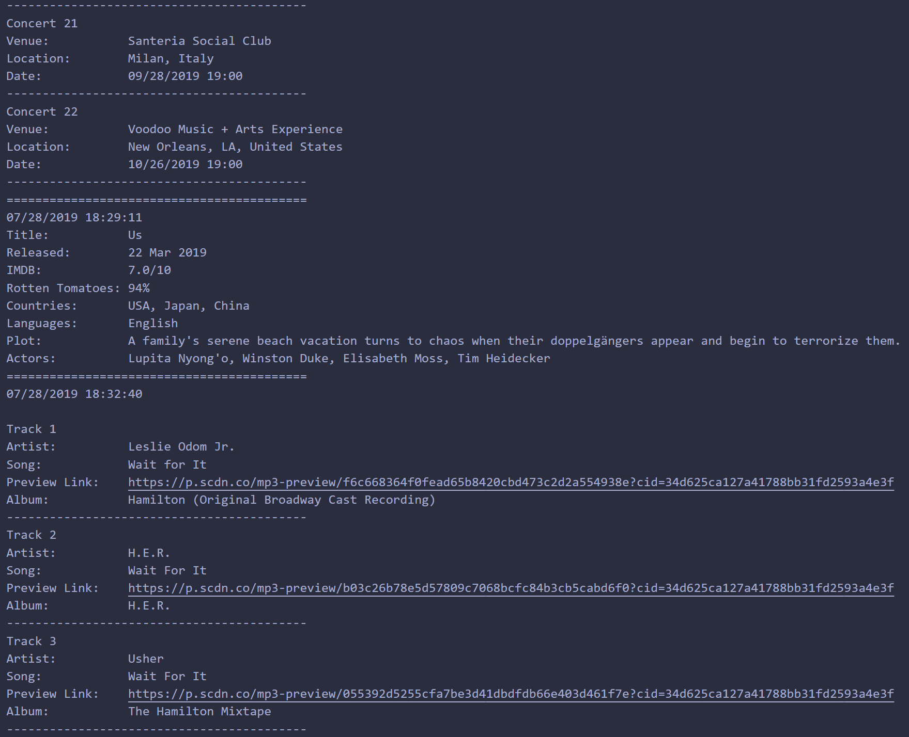

# HW-10-LIRI-Node-App
This app is designed to allow the user to search for a song, movie, or artist/band using APIs and retireve information about them.

## Install Dependencies
In your terminal, after downloading this repo, install all required node packages with:

```
npm i
```

## Using LIRI
LIRI takes 4 commands:
```
node liri.js concert-this <artist/band name>
node liri.js spotify-this-song <song name>
node liri.js movie-this <movie title>
node liri.js do-what-it-says
```

You can also use `node liri.js help` if you forget these commands

### concert-this
This command searches the Bands in Town API for an artist/band given by the user. It will return the next venue the artist/band will be performing at, as well as the location, date, time.


### spotify-this-song
This command will search the Spotify API using a song given by the user. It will return the top 20 results' Artist(s), Song Name, a Preview Link the user can click to listen to the song, and the Album the song is from.


### movie-this
This command takes a movie given by the user and searches the OMDb API for the top result. It will return the movie's Title, Date/Language(s) of Release, IMDB and Rotten Tomatoes ratings, Country Produced in, Plot, and top Actors


### do-what-it-says
This command will read from random.txt and run the first command it encounters. In this case, that command is `spotify-this-song I want it that way`.


## Log.txt
LIRI will also save a log of all the users results and when they made the request, including any errors the user may have encountered while using the application.

